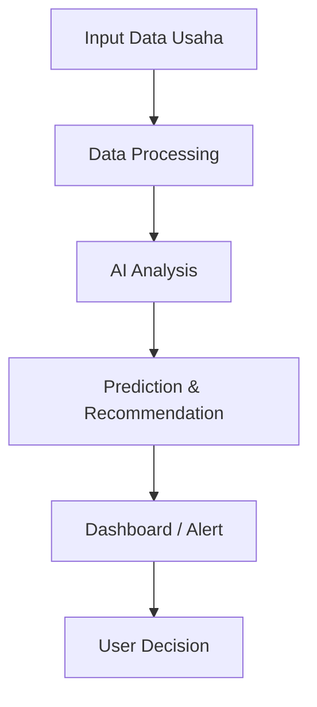
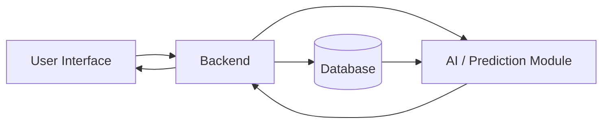

# SmartBiz AI by Kelompok 9

## Sistem Pendukung Keputusan Cerdas untuk Optimasi Keuangan dan Persediaan Usaha

[](https://www.python.org/)
[](https://docs.astral.sh/uv/)
[](LICENSE)
[](#roadmap)

SmartBiz AI adalah sistem berbasis Artificial Intelligence yang membantu pemilik usaha menganalisis kondisi keuangan, memperoleh rekomendasi harga jual produk, serta memantau dan memprediksi kebutuhan persediaan. Sistem ini dirancang sebagai proyek AI mahasiswa selama satu semester dan masih dikembangkan secara bertahap.

## Daftar Isi

- [Deskripsi Project](#deskripsi-project)
- [Tujuan Project](#tujuan-project)
- [Problem Statement](#problem-statement)
- [AI Approach / Intelligent System](#ai-approach--intelligent-system)
- [PEAS](#peas)
- [Fitur Utama](#fitur-utama)
- [System Workflow](#system-workflow)
- [System Architecture](#system-architecture)
- [Roadmap](#roadmap)
- [Struktur Project](#struktur-project)
- [Instalasi](#instalasi)
- [How to Run](#how-to-run)
- [Contoh Use Case](#contoh-use-case)
- [Future Development](#future-development)
- [Team](#team)
- [License](#license)

## Deskripsi Project

Pemilik usaha sering memiliki banyak data produk, bahan baku, biaya produksi, penjualan, pemasukan, pengeluaran, stok, dan transaksi, tetapi tidak selalu mudah mengubah data tersebut menjadi keputusan yang tepat. Kondisi ini dapat menyulitkan pemilik usaha ketika mengevaluasi laba, menentukan harga jual, atau memutuskan kapan harus melakukan restock.

SmartBiz AI mengolah data keuangan dan persediaan untuk menampilkan kondisi usaha secara lebih terstruktur. Sistem memberikan analisis seperti omzet, pemasukan dan pengeluaran, laba/rugi, margin keuntungan, performa produk, serta insight kondisi keuangan. Selain itu, sistem menyediakan rekomendasi harga jual, prediksi kebutuhan persediaan berdasarkan pola penjualan historis jika data tersedia, dan peringatan ketika stok berada dalam kondisi kritis.

Project ini bukan sistem akuntansi murni dan bukan hanya dashboard CRUD. Unsur kecerdasannya terletak pada analisis data, prediksi permintaan persediaan, serta rekomendasi keputusan yang mendukung pemilik usaha.

## Tujuan Project

- Membantu pemilik usaha memahami kondisi keuangan berdasarkan data transaksi.
- Memberikan rekomendasi harga jual dengan mempertimbangkan biaya dan target margin.
- Memantau jumlah stok dan kondisi persediaan secara terstruktur.
- Memprediksi kebutuhan stok berdasarkan pola penjualan historis jika data tersedia.
- Memberikan peringatan dan rekomendasi restock ketika persediaan mendekati kondisi kritis.
- Mendukung pengambilan keputusan usaha berbasis data dan bukan hanya intuisi.

## Problem Statement

Permasalahan yang ingin dibantu oleh SmartBiz AI meliputi:

- Pemilik usaha kesulitan memahami kondisi keuangan dari banyak data transaksi.
- Penentuan harga jual dapat tidak konsisten karena belum mempertimbangkan seluruh biaya dan target margin.
- Risiko kehabisan stok dapat mengganggu penjualan.
- Kelebihan stok dapat meningkatkan biaya penyimpanan dan risiko bahan atau produk tidak terpakai.
- Keputusan restock sering dilakukan tanpa mempertimbangkan pola penjualan dan sisa stok secara memadai.

## AI Approach / Intelligent System

SmartBiz AI memisahkan perhitungan berbasis aturan dari analisis dan prediksi yang memerlukan model AI. Metode AI spesifik dapat ditentukan setelah data dipahami dan dievaluasi; README ini tidak menganggap metode tertentu sebagai fitur final.

### Financial Analysis

Data pemasukan, pengeluaran, biaya produksi, harga jual, dan transaksi diolah untuk menghitung omzet, laba/rugi, margin keuntungan, dan performa produk. Perhitungan metrik dasar ini menggunakan formula dan rule-based logic. Insight kondisi keuangan dapat dikembangkan dengan analisis berbasis data.

### Price Recommendation

Sistem menghitung dasar rekomendasi dari biaya bahan baku, biaya produksi, HPP, dan target margin. Data penjualan historis dapat digunakan sebagai konteks tambahan. Hasilnya adalah **rekomendasi harga jual**, bukan penetapan harga secara mutlak oleh AI. Perhitungan awal dapat menggunakan rule-based logic, sedangkan model AI atau analisis historis dapat ditambahkan dan dievaluasi sesuai ketersediaan data.

### Inventory Monitoring

Sistem mencatat jumlah stok saat ini, batas minimum stok, dan histori perubahan stok. Status stok, termasuk kondisi rendah atau kritis, ditentukan menggunakan rule-based logic berdasarkan batas yang ditetapkan.

### Inventory Demand Prediction

Jika data penjualan historis tersedia, model AI atau metode prediksi yang sesuai dapat mempelajari pola permintaan untuk memperkirakan kebutuhan persediaan. Sebagai ilustrasi, stok 20 unit dengan rata-rata penjualan 5 unit per hari dapat menghasilkan perkiraan stok habis sekitar 4 hari lagi. Hasil prediksi bergantung pada kualitas, jumlah, dan pola data yang tersedia.

### Restock Recommendation

Sistem dapat memicu peringatan ketika stok berada di bawah batas minimum atau diperkirakan habis dalam waktu dekat. Rekomendasi restock dapat menggabungkan rule-based logic dengan hasil prediksi permintaan. Rekomendasi ini menjadi dukungan keputusan dan tetap perlu ditinjau oleh pemilik usaha.

## PEAS

| Komponen | Spesifikasi SmartBiz AI |
| --- | --- |
| **Performance Measure** | Ketepatan perhitungan metrik keuangan, relevansi rekomendasi harga dan restock, kualitas prediksi permintaan, ketepatan peringatan stok, waktu respons, dan kemudahan penggunaan. |
| **Environment** | Data operasional usaha, produk, bahan baku, biaya produksi, transaksi, penjualan, pemasukan, pengeluaran, dan persediaan. |
| **Actuators** | Menampilkan analisis keuangan, memberikan rekomendasi harga jual, menampilkan status stok, menghasilkan prediksi kebutuhan, serta mengirimkan peringatan dan rekomendasi restock. |
| **Sensors** | Input data produk dan bahan baku, biaya, harga jual, jumlah penjualan, transaksi, pemasukan, pengeluaran, stok saat ini, batas minimum stok, dan histori perubahan stok. |

## Fitur Utama

- **Financial Dashboard:** ringkasan omzet, pemasukan, pengeluaran, laba/rugi, margin, dan insight keuangan.
- **Product & Raw Material Data:** pengelolaan data produk, bahan baku, biaya produksi, dan harga jual.
- **Profit/Loss Analysis:** analisis laba/rugi dan performa produk berdasarkan data yang dimasukkan.
- **Price Recommendation:** rekomendasi harga jual berdasarkan HPP, biaya, target margin, dan bila tersedia data penjualan historis.
- **Inventory Monitoring:** pemantauan stok saat ini, batas minimum, dan histori perubahan stok.
- **Stock Alert:** peringatan ketika stok rendah atau berada dalam kondisi kritis.
- **Demand/Stock Prediction:** prediksi kebutuhan persediaan berdasarkan pola penjualan historis jika data mencukupi.
- **Restock Recommendation:** rekomendasi tindakan restock dengan mempertimbangkan kondisi stok dan hasil prediksi.

## System Workflow



## System Architecture

Arsitektur sistem dirancang menggunakan komponen umum agar implementasinya dapat disesuaikan dengan hasil pengembangan dan evaluasi project.



- **User Interface:** tempat pemilik usaha memasukkan data dan melihat analisis, prediksi, rekomendasi, serta alert.
- **Backend:** menangani validasi input, proses bisnis, perhitungan metrik, dan komunikasi antarkomponen.
- **Database:** menyimpan data produk, bahan baku, transaksi, keuangan, persediaan, dan histori.
- **AI/Prediction Module:** menjalankan analisis data, metode prediksi yang sesuai, dan logika rekomendasi yang membutuhkan hasil analisis.

## Roadmap

| Milestone | Fokus | Output |
| --- | --- | --- |
| **M1** | Problem Definition & Project Planning | Rumusan masalah, tujuan, ruang lingkup, PEAS, dan rancangan awal sistem. |
| **M2** | Data Collection & Data Understanding | Sumber atau skema data, pemahaman atribut, definisi metrik, dan analisis awal kualitas data. |
| **M3** | Data Processing & AI Model Development | Pra-pemrosesan data, baseline rule-based, eksplorasi model AI atau metode prediksi, serta evaluasi awal. |
| **M4** | System Integration & Dashboard | Integrasi modul analisis, prediksi, rekomendasi, penyimpanan data, dan dashboard atau antarmuka. |
| **M5** | Testing, Evaluation & Final Presentation | Pengujian sistem, evaluasi hasil, analisis keterbatasan, dokumentasi, dan presentasi final. |

## Struktur Project

Struktur berikut menggambarkan struktur Python/AI project. Baseline UCS yang sudah tersedia berada pada folder `scripts/`; folder implementasi AI lainnya dapat ditambahkan sesuai kebutuhan milestone.

```text
smartbiz-ai/
├── README.md
├── LICENSE
├── pyproject.toml
├── uv.lock
├── src/
│   └── smartbiz_ai/
│       ├── __init__.py
│       ├── analysis/
│       ├── recommendation/
│       ├── inventory/
│       └── prediction/
├── data/
│   ├── raw/
│   └── processed/
├── notebooks/
├── tests/
├── docs/
└── scripts/
    └── ucs_production.py
```

## Instalasi

### Prasyarat

- Python **3.11 atau lebih baru**.
- [Astral `uv`](https://docs.astral.sh/uv/getting-started/installation/) tersedia pada `PATH`.
- Git untuk mengambil dan mengelola repository.

### Menyiapkan environment

Jalankan perintah berikut dari root repository:

```bash
uv venv
uv sync
```

Aktivasi environment secara opsional:

```bash
# Windows PowerShell
.venv\Scripts\Activate.ps1

# Linux/macOS
source .venv/bin/activate
```

Dependency project didefinisikan pada `pyproject.toml`. Saat ini dependency aplikasi belum ditambahkan. Gunakan `uv add <nama-paket>` hanya ketika dependency baru memang diperlukan oleh implementasi.

## How to Run

Baseline UCS untuk keputusan produksi tersedia pada `scripts/ucs_production.py`. Modul ini hanya menangani alur persediaan berikut:

```text
Data penjualan
→ kebutuhan/permintaan produk
→ kondisi stok
→ graph keputusan produksi
→ UCS dengan f(n) = g(n)
→ rekomendasi produksi berbiaya minimum
```

Jalankan contoh baseline dari root repository:

```bash
uv run python scripts/ucs_production.py
```

Contoh tersebut menggunakan produk Brownies, stok awal 5 unit, kebutuhan 20 unit, dan pilihan batch produksi 5, 10, atau 15 unit. State/node adalah kondisi stok, action/edge adalah keputusan produksi, dan cost adalah biaya produksi nyata. UCS mencari total biaya minimum sampai stok memenuhi kebutuhan.

Modul ini merupakan salah satu bagian SmartBiz AI untuk mendukung keputusan persediaan dan produksi. Modul ini bukan supplier selection, route optimization, maupun sistem logistik. Perhitungan HPP, keuntungan, dan margin tetap merupakan perhitungan bisnis terpisah dari algoritma UCS.

Untuk memeriksa bahwa environment Python project dapat digunakan, jalankan:

```bash
uv run python --version
```

## Contoh Use Case

Misalnya sebuah usaha bakery memasukkan data berikut:

- bahan baku tepung, telur, gula, dan bahan lain;
- biaya produksi setiap produk;
- harga jual produk;
- jumlah penjualan dan transaksi;
- pemasukan dan pengeluaran;
- stok produk atau bahan baku serta batas minimum stok.

SmartBiz AI kemudian dapat:

1. menghitung omzet, laba/rugi, dan margin produk;
2. memberikan rekomendasi harga jual berdasarkan HPP, biaya produksi, dan target margin;
3. menampilkan stok saat ini dan histori perubahan stok;
4. memperkirakan waktu stok habis jika data penjualan historis mencukupi; dan
5. menampilkan alert serta rekomendasi restock ketika stok rendah atau diperkirakan segera habis.

## Future Development

Pengembangan berikut masih dapat dipertimbangkan setelah kebutuhan, data, dan hasil evaluasi project lebih jelas:

- membandingkan beberapa metode prediksi yang sesuai dengan karakteristik data;
- meningkatkan evaluasi akurasi prediksi dan relevansi rekomendasi;
- menambahkan analisis sensitivitas terhadap biaya dan target margin;
- memperbaiki visualisasi tren keuangan dan persediaan; dan
- mengembangkan integrasi antarmuka serta notifikasi sesuai kebutuhan pengguna.

Daftar tersebut merupakan kemungkinan pengembangan, bukan klaim bahwa fitur sudah tersedia atau menjadi fitur final.

## Team

| Nama | NIM | Role |
| --- | --- | --- |
| Margareth Bungaran Sitompul | 12S24006 | Role |
| Griselda Tabitha Nathania Hutahaean | 12S24026 | Role |
| Josef Christian Marpaung | 12S24036 | Role |

## License

Project ini menggunakan **MIT License**. Ketentuan lengkap tersedia pada file [LICENSE](LICENSE).

## Acknowledgment

Project ini disusun untuk memenuhi rangkaian proyek terpadu mata kuliah **10S3001 - Kecerdasan Buatan**, Program Sarjana Sistem Informasi, Institut Teknologi Del, Semester Gasal 2026/2027, dengan dosen pengampu **Samuel Indra Gunawan Situmeang**.
