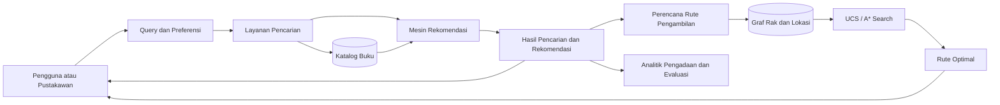

# Library AI: Sistem Cerdas untuk Pencarian dan Rekomendasi Buku pada Perpustakaan IT Del

[](https://www.python.org/)
[](https://docs.astral.sh/uv/)
[](LICENSE)
[](#roadmap-dan-progres)

Sistem cerdas untuk membantu pencarian koleksi, rekomendasi buku, dukungan pengadaan koleksi, dan optimasi rute pengambilan buku pada Perpustakaan Institut Teknologi Del (IT Del). Repository ini mendokumentasikan seluruh pengerjaan proyek selama satu semester, mulai dari perumusan masalah hingga evaluasi Proyek Akhir/UAS.

> **Dokumentasi hidup:** README ini akan diperbarui pada setiap milestone. Status, fitur, struktur modul, hasil eksperimen, dan tautan artefak akan ditambahkan seiring proyek berjalan.

## Daftar Isi

- [Latar Belakang dan Tujuan](#latar-belakang-dan-tujuan)
- [Spesifikasi PEAS](#spesifikasi-peas)
- [Roadmap dan Progres](#roadmap-dan-progres)
- [Fitur](#fitur)
- [Arsitektur Sistem](#arsitektur-sistem)
- [Struktur Direktori](#struktur-direktori)
- [Instalasi dan Setup](#instalasi-dan-setup)
- [Menjalankan Program](#menjalankan-program)
- [Contoh Input dan Output](#contoh-input-dan-output)
- [Repository dan Version Control](#repository-dan-version-control)
- [Anggota Tim](#anggota-tim)
- [Lisensi](#lisensi)
- [Acknowledgment](#acknowledgment)

## Latar Belakang dan Tujuan

Proyek ini dikerjakan secara berkelompok oleh 3-4 mahasiswa Program Sarjana Sistem Informasi sebagai proyek terpadu mata kuliah **10S3001 - Kecerdasan Buatan**, Semester Gasal 2026/2027. Sistem dirancang untuk menjawab beberapa tantangan operasional perpustakaan:

- pencarian koleksi yang masih bergantung pada pencocokan keyword secara literal;
- personalisasi rekomendasi buku yang masih terbatas;
- proses pengadaan koleksi yang cenderung reaktif;
- tingginya beban layanan referensi manual; dan
- rute pengambilan koleksi fisik antar-rak atau lokasi yang belum optimal.

### Tujuan

1. Membangun fondasi pencarian koleksi yang lebih cerdas dan relevan.
2. Menghasilkan rekomendasi buku yang lebih personal berdasarkan data pengguna dan koleksi.
3. Mendukung pengambilan keputusan pengadaan koleksi berbasis data.
4. Mengurangi beban layanan referensi melalui otomatisasi bantuan pencarian.
5. Mengoptimalkan rute pengambilan buku secara fisik menggunakan algoritma pencarian ruang keadaan.

### Konteks Penilaian

Lima Milestone Terpadu menyumbang **36% dari Nilai Komponen Proyek** sebagai fondasi menuju evaluasi Proyek Akhir/UAS. Evaluasi Proyek Akhir/UAS menyumbang **64%** melalui Showcase (32%) dan Portofolio/Laporan (32%). Secara keseluruhan, komponen Proyek berkontribusi **30% terhadap nilai akhir perkuliahan**.

## Spesifikasi PEAS

| Komponen | Spesifikasi sistem |
| --- | --- |
| **Performance Measure** | Relevansi hasil pencarian dan rekomendasi, waktu respons, optimalitas biaya rute, tingkat keberhasilan pencarian koleksi, kepuasan pengguna, serta kemudahan pemeliharaan sistem. |
| **Environment** | Perpustakaan IT Del, katalog dan metadata buku, data peminjaman atau interaksi pengguna, tata letak rak/lokasi, aturan operasional perpustakaan, serta kondisi ketersediaan koleksi. |
| **Actuators** | Menampilkan hasil pencarian, memberikan rekomendasi, menyarankan prioritas pengadaan, menghasilkan rute pengambilan buku, dan menyediakan informasi pendukung bagi pengguna atau pustakawan. |
| **Sensors** | Query pengguna, metadata buku, status ketersediaan, histori peminjaman/interaksi, lokasi rak, bobot atau jarak antar-lokasi, serta umpan balik pengguna. |

## Roadmap dan Progres

Roadmap berikut menjadi catatan kerja yang diperbarui sepanjang semester. Detail topik M2-M5 dapat disesuaikan setelah pembagian tugas dan arahan perkuliahan berikutnya.

| Milestone | Fokus | Status |
| --- | --- | --- |
| **M1** | Business Problem Framing, spesifikasi PEAS, dan baseline pencarian ruang keadaan menggunakan Uniform Cost Search (UCS) / A* Search dengan `heapq` untuk optimasi rute pengambilan koleksi. | **Selesai** |
| **M2** | *Placeholder:* akan ditentukan dan dilengkapi berdasarkan fokus milestone. | **Akan diperbarui** |
| **M3** | *Placeholder:* akan ditentukan dan dilengkapi berdasarkan fokus milestone. | **Akan diperbarui** |
| **M4** | *Placeholder:* akan ditentukan dan dilengkapi berdasarkan fokus milestone. | **Akan diperbarui** |
| **M5** | *Placeholder:* akan ditentukan dan dilengkapi berdasarkan fokus milestone. | **Akan diperbarui** |
| **Proyek Akhir / UAS** | Integrasi sistem, evaluasi, Showcase, serta Portofolio/Laporan. | **Akan diperbarui** |

## Fitur

### Selesai pada M1

- [x] Business Problem Framing untuk konteks Perpustakaan IT Del.
- [x] Spesifikasi PEAS sistem cerdas.
- [x] Baseline Uniform Cost Search (UCS) untuk pencarian rute.
- [x] Baseline A* Search dengan heuristik biaya/jarak.
- [x] Penggunaan `heapq` sebagai priority queue untuk efisiensi pencarian.
- [x] Pemodelan lokasi rak dan koneksi antar-lokasi sebagai ruang keadaan.

### Direncanakan untuk milestone berikutnya

- [ ] Pencarian koleksi berbasis relevansi semantik.
- [ ] Rekomendasi buku yang dipersonalisasi.
- [ ] Analisis kebutuhan dan prioritas pengadaan koleksi.
- [ ] Bantuan referensi otomatis.
- [ ] Evaluasi kuantitatif, visualisasi, dan analisis error.
- [ ] Antarmuka pengguna dan integrasi seluruh komponen.
- [ ] Dokumentasi eksperimen, Showcase, dan Portofolio/Laporan.

## Arsitektur Sistem



## Struktur Direktori

Struktur berikut merupakan rancangan organisasi proyek Python yang akan dikembangkan dan disesuaikan pada milestone berikutnya.

```text
library-ai-itdel/
├── README.md
├── LICENSE
├── pyproject.toml
├── uv.lock
├── src/
│   └── library_ai/
│       ├── __init__.py
│       ├── search/
│       │   ├── __init__.py
│       │   └── pathfinding.py       # UCS dan A* Search
│       ├── recommendation/
│       ├── retrieval/
│       └── evaluation/
├── data/
│   ├── raw/                         # Data mentah, tidak diubah
│   ├── processed/                   # Data hasil pra-pemrosesan
│   └── README.md
├── docs/                            # Spesifikasi, diagram, dan laporan teknis
├── notebooks/                       # Eksplorasi dan eksperimen
├── tests/                           # Unit test dan integration test
└── scripts/                         # Utilitas pra-pemrosesan atau eksperimen
```

## Instalasi dan Setup

### Prasyarat

- Python **3.11 atau lebih baru**.
- [Astral `uv`](https://docs.astral.sh/uv/getting-started/installation/) terpasang dan tersedia pada `PATH`.
- Git untuk mengambil dan mengelola repository.

### Menyiapkan environment

Jalankan perintah berikut dari root repository:

```bash
uv venv
uv sync
```

Aktivasi environment secara opsional:

```bash
# Windows PowerShell
.venv\Scripts\Activate.ps1

# Linux/macOS
source .venv/bin/activate
```

Dependensi proyek didefinisikan pada `pyproject.toml`. Gunakan `uv add <nama-paket>` untuk menambahkan dependensi baru dan `uv lock` untuk memperbarui lockfile.

## Menjalankan Program

Contoh berikut menggambarkan antarmuka modul pencarian M1 setelah modul tersedia pada struktur proyek:

```bash
# Uniform Cost Search
uv run python -m library_ai.search.pathfinding \
  --algorithm ucs \
  --start pintu-masuk \
  --goal rak-ai

# A* Search
uv run python -m library_ai.search.pathfinding \
  --algorithm astar \
  --start pintu-masuk \
  --goal rak-ai
```

Sesuaikan nama modul, argumen, dan format data dengan implementasi aktual yang ditambahkan pada repository. Perintah pengujian yang direkomendasikan:

```bash
uv run pytest
```

## Contoh Input dan Output

Contoh konseptual input untuk pencarian rute:

```json
{
  "algorithm": "astar",
  "start": "pintu-masuk",
  "goal": "rak-ai",
  "graph": {
    "pintu-masuk": {"rak-pemrograman": 4},
    "rak-pemrograman": {"rak-ai": 3},
    "rak-ai": {}
  }
}
```

Contoh output:

```text
Algorithm : A*
Path      : pintu-masuk -> rak-pemrograman -> rak-ai
Cost      : 7
Expanded  : 3 states
```

Nilai di atas adalah ilustrasi untuk menjelaskan kontrak input/output; hasil aktual bergantung pada graf lokasi, bobot sisi, dan heuristik yang digunakan.

## Repository dan Version Control

Repository ini menggunakan **MIT License**; ketentuan lengkapnya tersedia pada file [LICENSE](LICENSE). Manajemen environment dan dependensi menggunakan Astral `uv`: `pyproject.toml` mendefinisikan metadata proyek serta dependensi, sedangkan `uv.lock` mengunci resolusi dependensi agar setup dapat direproduksi. File `.gitignore` mengecualikan environment lokal, file rahasia, cache, dan artefak hasil generate tanpa mengabaikan dokumentasi atau konfigurasi proyek.

Git digunakan untuk version control dan mencatat riwayat perubahan repository. Saat ini riwayat berisi commit awal `3735fa6 readme`.

## Anggota Tim

| Nama | NIM | Peran / Tanggung Jawab |
| --- | --- | --- |
| *Margareth Bungaran Sitompul* | *12S24006* | *Akan diisi* |
| *Griselda Tabitha Nathania Hutahaean* | *12S24026* | *Akan diisi* |
| *Josef Christian Marpaung* | *12S24036* | *Akan diisi* |

## Lisensi

Proyek ini dirilis di bawah **MIT License**. Ketentuan lengkap dapat dibaca pada file [LICENSE](LICENSE).

## Acknowledgment

Proyek ini disusun untuk memenuhi rangkaian proyek terpadu mata kuliah **10S3001 - Kecerdasan Buatan**, Program Sarjana Sistem Informasi, Institut Teknologi Del, Semester Gasal 2026/2027, dengan dosen pengampu **Samuel Indra Gunawan Situmeang**.
